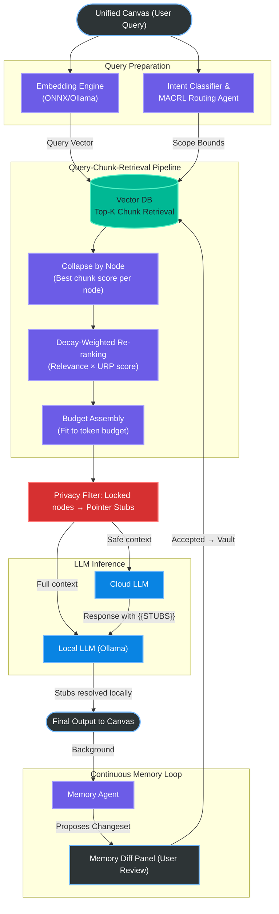

# Amber

> Your notes. Your machine. An AI that actually knows what you know.

Amber is a **local-first, privacy-by-design** personal knowledge platform . Amber is a home for everything you know. Stay organized. 

Make it useful over time. 

Amber organizes all your coursework from across your subjects so they all relate. Manage projects, calls, and contacts for your job; it all connects in one place. Build and maintain an interconnected database so you can find everything you need. Amber organizes your knowledge, keeps your AIs relevant, and keeps your data safe.

## TL;DR

Your notes pile up unread. Your AI forgets everything between sessions. Your best thinking quietly disappears into a graveyard of files you'll never open again.

Amber is a **local-first personal knowledge platform** that fights back. Organize everything into structured Vaults, chat with your entire knowledge base, and let a background Memory Agent quietly preserve what matters — all on your own machine, with your data never leaving your device unless you choose.

## Why Amber?

Most note-taking apps are too dumb. Cloud AI tools are too invasive. Amber closes that gap.

- **A Knowledge Platform That Actually Gets You** instead of starting every conversation with the void, Amber's AI leverages your own notes and history. Automatically. 
- **Nothing leaves your device by default**: built with a local-first mindset with cloud features only used with opt-in and sensitive data safeguarded even when cloud is used. 
- **Use Any LLM** bring your own API key, or even run models offline on local hardware. 
- **Organized The Way Life Works** hierarchical vaults, tags, cross-references and visual workspace provides instant clarity.

## Features

### Organize Everything, Your Way

**Vaults, Sub-Vaults & Nodes**

Structure your knowledge as your mind works. A Vault is a home to everything in any part of your life. Nest other Vaults inside and save your notes as nodes. Everything has a home; nothing gets lost.

```
University (Vault)
  └── Year 3 (Sub-Vault)
        └── CEM 484 Molecular Thermodynamics (Sub-Vault)
              ├── Lecture 1 (Node)
              ├── Lecture 2 (Node)
              └── Assignment 1 (Node)
```

You can have as many top-level vaults as you need: Work, Personal, Health, Finance, Projects; each with its own structure inside.

**Tags**

Give a tag to a node or sub-vault - it can be topic, status, person, or priority level, and filter across your entire knowledge.

**Cross-Vault Doors**

Ideas don't stay in silos, and neither should your notes. Connect any two nodes or vaults with a Door, and the relationship is preserved both ways. Your Molecular Thermodynamics notes linked to your summer internship at a chemical company? One Door, and the context travels with you. Type `[[NodeName]]` from anywhere in the editor to create a link in seconds.

**Usage-Relative Priority (URP)**

Amber quietly notes which parts of your knowledge you're actively using. When your AI needs context, it focuses on what's relevant to you *right now* — not equally from every note you've ever written. Your Year 1 coursework is still there if you need it. It just doesn't crowd out what you're working on today.

---

### A Knowledge Base That Actually Knows You

**Talk to Your Knowledge Base**

Ask Amber anything and it searches across your entire vault, not just the note you have open. Get answers grounded in your own writing, assembled automatically from the notes most relevant to your question.

**Memory Agent**

As you chat, Amber's Memory Agent quietly extracts new facts and suggests additions or updates to your vault in the background. You review every change before anything is saved. If you correct yourself mid-conversation, Amber catches it. Nothing is written to your vault without your approval.

**Off the Record Mode**

Sometimes you want to think out loud without anything being remembered. Switch to Off the Record and your session stays private. No memory extraction, no vault writes. Convert it to memory whenever you're ready.

---

### Privacy by Design

Amber's privacy isn't a setting you toggle. It's built into the structure of every note.

Every node has a **Privacy Tier** that controls exactly how it's used:

| Tier | What it means |
|---|---|
| **Open** | Available for both local and cloud AI context |
| **Local Only** | Stays on your device — never sent to a cloud LLM, even if you use one |
| **Locked** | The AI knows this note exists but never sees its contents (referenced by a placeholder stub) |
| **Redacted** | Invisible to everything, including exports |

Amber is designed first for AI models you run on your own hardware. Cloud LLMs are supported as a secondary option for heavier workloads — but your Local Only and Locked notes never leave your device, regardless.

---

### Write Naturally. Read Beautifully.

**Full-Featured Editor**

Write with a formatting toolbar. Headings, bold, lists, tables, links, checkboxes without ever seeing a line of Markdown syntax. Under the hood your notes are plain Markdown (which keeps them lightweight and AI-friendly), but the editor looks and feels like a proper document editor.

**Rich Rendering**

Your notes render fully: Mermaid diagrams, charts, images, hyperlinks, inline and display math, code blocks with syntax highlighting, tables, checkboxes, and more. All displayed cleanly, right inside the note.

**Version History**

Amber keeps a running history of your vault, similar to how Google Docs tracks document versions. Browse previous states, see exactly what changed, and restore individual notes to an earlier version without affecting anything else.

**Spatial Workspace**

See your entire knowledge base at once without the overwhelm. Instead of an unreadable tangle of dots and lines, Amber's canvas displays each Vault as a card containing its own structure inside it. Browse, search, and navigate visually. Zoom out for the big picture; click into any card to work inside it.

---

### Always With You

**Mobile Companion**

Access your vaults from your phone. Capture a quick note on the go and it syncs back to your desktop. Local Only and Locked nodes stay off the mobile device only what you've permitted will sync to the cloud storage.

**Meeting Recorder**

Record any meeting, lecture, or voice memo directly in Amber. Transcription runs locally, the Memory Agent extracts the key takeaways, and the Diff Panel shows you exactly what it's proposing to add to your vault before anything is saved.

**System Overlay**

A lightweight widget sits at the edge of your screen, available anywhere on your desktop without opening the app. Screenshot something interesting, highlight text in any window, or type a quick thought and it will be routed to the right vault.

---

### Daily Habits & Smart Reminders *(Pro)*

**Morning Brief & Evening Wrap**

Start each day with a summary of your most relevant notes, open tasks, and upcoming calendar events — surfaced from your own vault, not from a generic to-do app. End the day with a brain dump that the Memory Agent turns into tomorrow's context.

**Contextual Reminders**

Tag notes with people, places, or relationships and Amber connects the dots. If you've noted "Dad needs a new wallet" and his birthday is in five days, Amber surfaces it — because it knows both pieces of information and understands the relationship between them.

---

### Connect the Tools You Already Use *(Pro)*

Amber can share context with AI tools you already use — so your knowledge base becomes a shared memory layer across your workflow. The same privacy tiers are enforced at the boundary; your Local Only and Locked notes stay protected even when external tools are connected.

---

### LLM Compute Credits

No API key management required. Amber's managed LLM access system. An alternative to managing your own API keys.
This can include access to private cloud compute to large open source models (i.e. GLM 5.2) or access to cloud LLMs (i.e. Claude, GPT) through our API.

---

### Plugin Marketplace

Community plugins extend Amber for specific workflows. Install from the marketplace or build your own.

---

## Getting Started

### Prerequisites

- **Node.js**: 24+
- **Rust**: stable toolchain (install via `rustup`)
- **System deps (Linux only)**: you need WebKitGTK + a few build libs.

Example for Ubuntu/Debian:

```bash
sudo apt-get update
sudo apt-get install -y \
  libwebkit2gtk-4.1-dev build-essential curl wget file libxdo-dev libssl-dev \
  libayatana-appindicator3-dev librsvg2-dev patchelf
```

### Install

From the repo root:

```bash
npm ci
```

### Run the desktop app (Tauri)

```bash
npm run tauri dev
```

### Run the UI only (Vite dev server)

```bash
npm run dev
```

### Lint / typecheck

```bash
npm run lint
npx tsc --noEmit
```

### Rust checks (core)

```bash
cd core
cargo fmt
cargo clippy
cargo test
```

## Before Committing

Amber uses a single cross-platform preflight gate that matches CI.

```bash
# Auto-fix formatting first (recommended)
npm run preflight:fix

# Then commit
git add -A
git commit -m "your message"
```

If you want checks only (no auto-fixes):

```bash
npm run preflight
```

---

## Technical Architecture

*This section is for contributors and the technically curious. You don't need to read this to use Amber.*

Modern LLM interfaces are stateless by default. Every new conversation starts cold, and the common workarounds — forcing huge context windows or flat RAG pipelines — are token-expensive, prone to hallucinations, and bad for privacy.

Amber solves this with a structured retrieval architecture that assembles a *better-shaped* context, not just a larger one.



**Key subsystems:**

**Embedding Engine & MACRL Intent Classifier** — Queries are embedded locally using a hardware-tiered ONNX model (or Ollama for power users). A Multi-Agent Collaborative Reinforcement Learning (MACRL) classifier runs concurrently to bound the retrieval scope to relevant vaults.

**Query-Chunk-Retrieval (QCR) Pipeline** — The query vector retrieves top-K chunks from a local vector database, collapses chunk-level results to their parent node (best chunk score wins), re-ranks by a combined relevance and URP decay score, then assembles the final context to fit the target LLM's token budget exactly.

**Privacy Filter & Two-LLM Cascade** — Before any context is sent to a cloud LLM, the Privacy Filter strips Local Only nodes and replaces Locked nodes with pointer stubs. The cloud LLM processes the safe prompt and returns a response containing stub placeholders. A fast local model intercepts the response and resolves stubs with local sensitive content before the final output reaches the canvas.

**Memory Agent → Diff Panel** — After each session, the Memory Agent extracts candidate facts and proposes a structured changeset. The user reviews every proposed add, update, or merge in the Diff Panel before anything is written to the vault.

---

## Community

Join our [Discord Server](https://discord.gg/UYhqRHbH4M) to discuss features, get help with local LLM setups, report bugs, and chat with other Amber contributors.

---

## License & Open Core Architecture

Amber is built on a **three-repository Open Core model**:

| Repository | Visibility | License | Contains |
|---|---|---|---|
| **Amber** | Public | AGPLv3 | Core engine, desktop app, local graph, retrieval pipeline — the complete Free-tier product |
| **Amber Pro** | Private | Proprietary | Pro & Team features (Shared Vaults, Morning Brief, Meta-Prompting, Contextual Reminders, MCP Server) compiled into official releases via `--features pro` |
| **Amber Cloud** | Private | Proprietary | Cloud sync, authentication, billing, cloud storage, compute credit ledger |
| **Amber Mobile** | Private | Proprietary | iOS & Android companion app |

The public repository compiles and runs as a fully functional Free-tier app. Official release binaries link the private `Amber-pro` crate; community builds from source get upgrade prompt stubs in place of Pro features.

### Commercial Licensing

The AGPLv3 license requires any modified version you distribute to also be open source. If you want to embed or distribute the Amber engine inside a closed-source product, commercial licensing options are available. Feel free to contact us on [Discord](https://discord.gg/UYhqRHbH4M).