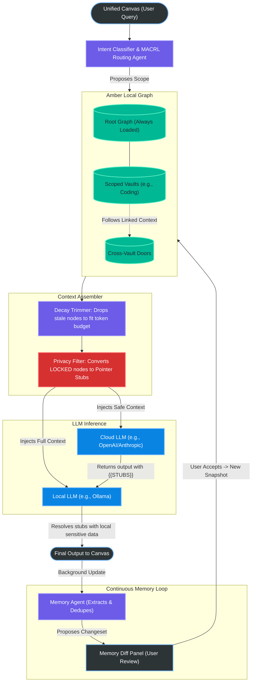

# About Amber

Modern LLM interfaces are **stateless** by default. Every new conversation starts cold, and the current workarounds such as **forcing huge context windows** or **flat RAG pipelines** are token-expensive, hallucinatory, and **horrible for privacy**.

Amber is a desktop-native knowledge architecture that acts as a persistent, structured, and **token-efficient memory** layer for local and cloud-hosted LLMs.

Amber does not just store personal memory as a huge number of text files rather it organizes knowledge into a set of specialized **Vaults**. When a query is made, a set of **Multi-Agent Collaborative Reinforcement Learning (MACRL)** routing agents extracts the intended context and pulls only relevant information straying across domain boundaries with a set of **Doors** while removing outdated information.

> The goal is not to give an AI a bigger context window, but to give it a better-shaped one.

## Table of Contents

- [Architecture Flow](#architecture-flow)
- [Getting Started](#getting-started)
  - [Prerequisites](#prerequisites)
  - [Install](#install)
  - [Run the desktop app (Tauri)](#run-the-desktop-app-tauri)
  - [Run the UI only (Vite dev server)](#run-the-ui-only-vite-dev-server)
  - [Lint / typecheck](#lint--typecheck)
  - [Rust checks (core)](#rust-checks-core)
- [Before committing](#before-committing)
- [Community](#community)
- [License](#license)

## Architecture Flow



## Getting Started

### Prerequisites

- **Node.js**: 24+
- **Rust**: stable toolchain (install via `rustup`)
- **System deps (Linux only)**: you need WebKitGTK + a few build libs.

Example for Ubuntu/Debian:

```bash
sudo apt-get update
sudo apt-get install -y \
  libwebkit2gtk-4.1-dev build-essential curl wget file libxdo-dev libssl-dev \
  libayatana-appindicator3-dev librsvg2-dev patchelf
```

### Install

From the repo root:

```bash
npm ci
```

### Run the desktop app (Tauri)

```bash
npm run tauri dev
```

### Run the UI only (Vite dev server)

```bash
npm run dev
```

### Lint / typecheck

```bash
npm run lint
npx tsc --noEmit
```

### Rust checks (core)

```bash
cd core
cargo fmt
cargo clippy
cargo test
```

## Before committing

Amber uses a single cross-platform preflight gate that matches CI.

### Windows (PowerShell) / macOS / Linux (bash) 

```bash
# Auto-fix formatting first (recommended)
npm run preflight:fix

# Then commit
git add -A
git commit -m "your message"
```

If you want checks only (no auto-fixes), run:

```bash
npm run preflight
```

## Community
Join our [Discord Server](https://discord.gg/UYhqRHbH4M) to discuss features, get help with local LLM setups, report bugs, and chat with other Amber contributors!

## License
This project is licensed under the AGPLv3 License - see the LICENSE file for details.
