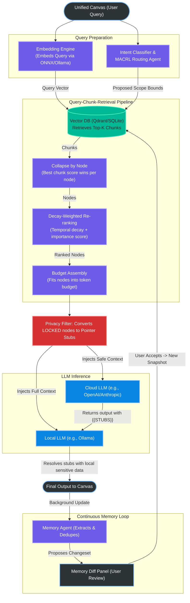

# About Amber

Modern LLM interfaces are **stateless** by default. Every new conversation starts cold, and current workarounds—like forcing huge context windows or using flat RAG pipelines—are token-expensive, prone to hallucinations, and compromise user privacy.

Amber is a **local-first, privacy-by-architecture** knowledge platform that acts as a persistent, structured, and token-efficient memory layer. Designed around a **Bring Your Own LLM (BYO LLM)** philosophy, Amber works seamlessly with both local models (via Ollama) and cloud-hosted APIs without ever exposing your sensitive data.

Instead of flat text storage, Amber organizes knowledge into semantic graphs called **Vaults**. When you query Amber, its retrieval engine employs a specialized **Decay Score System** to automatically prioritize fresh, highly-relevant context while deprecating stale information, and links related ideas across vault boundaries using **Doors**. Amber also implements the **Model Context Protocol (MCP)**, allowing it to serve as a secure context provider directly to external tools like Claude Desktop, Cursor, and custom agent workflows.

> The goal is not to give an AI a bigger context window, but to give it a better-shaped one.

## Table of Contents

- [Architecture Flow](#architecture-flow)
- [Getting Started](#getting-started)
  - [Prerequisites](#prerequisites)
  - [Install](#install)
  - [Run the desktop app (Tauri)](#run-the-desktop-app-tauri)
  - [Run the UI only (Vite dev server)](#run-the-ui-only-vite-dev-server)
  - [Lint / typecheck](#lint--typecheck)
  - [Rust checks (core)](#rust-checks-core)
- [Before committing](#before-committing)
- [Community](#community)
- [License & Open Core Architecture](#license--open-core-architecture)

## Architecture Flow



### Key Architectural Subsystems

1. **Embedding Engine & MACRL Intent Classifier**: Queries are embedded locally using a resource-optimized ONNX model (or Ollama fallback). Concurrently, a Multi-Agent Collaborative Reinforcement Learning (MACRL) classifier determines the intent and bounds the search scope (e.g., active Vaults).
2. **Query-Chunk-Retrieval (QCR) Pipeline**:
   - **Vector Search**: The query vector is used to retrieve the top-K chunks from the vector database (Qdrant or local SQLite store), scoped by intent.
   - **Node Collapse**: Since documents are chunked, the engine collapses chunk-level results by their parent `node_id` (using the highest chunk score as the representative score).
   - **Decay Re-ranking**: The collapsed nodes are re-ranked using a dynamic **Decay Score**, combining semantic relevance with temporal decay and importance weights.
   - **Budget Assembly**: The top-ranked nodes are packed to fit perfectly within the token budget of the target LLM.
3. **Privacy Filter & Two-LLM Cascade (Architecturally Planned)**: 
   - Before context leaves the machine for a Cloud LLM (OpenAI/Anthropic), the **Privacy Filter** strips sensitive local-only nodes and replaces them with cryptographic **Pointer Stubs** (e.g. `{{STUB_01}}`).
   - The Cloud LLM processes the safe prompt and returns a response containing these stubs.
   - A fast, local LLM/SLM intercepts the response and resolves the stubs with local, sensitive details before displaying the final output on the Unified Canvas.

## Getting Started

### Prerequisites

- **Node.js**: 24+
- **Rust**: stable toolchain (install via `rustup`)
- **System deps (Linux only)**: you need WebKitGTK + a few build libs.

Example for Ubuntu/Debian:

```bash
sudo apt-get update
sudo apt-get install -y \
  libwebkit2gtk-4.1-dev build-essential curl wget file libxdo-dev libssl-dev \
  libayatana-appindicator3-dev librsvg2-dev patchelf
```

### Install

From the repo root:

```bash
npm ci
```

### Run the desktop app (Tauri)

```bash
npm run tauri dev
```

### Run the UI only (Vite dev server)

```bash
npm run dev
```

### Lint / typecheck

```bash
npm run lint
npx tsc --noEmit
```

### Rust checks (core)

```bash
cd core
cargo fmt
cargo clippy
cargo test
```

## Before committing

Amber uses a single cross-platform preflight gate that matches CI.

### Windows (PowerShell) / macOS / Linux (bash) 

```bash
# Auto-fix formatting first (recommended)
npm run preflight:fix

# Then commit
git add -A
git commit -m "your message"
```

If you want checks only (no auto-fixes), run:

```bash
npm run preflight
```

## Community
Join our [Discord Server](https://discord.gg/UYhqRHbH4M) to discuss features, get help with local LLM setups, report bugs, and chat with other Amber contributors!

## License & Open Core Architecture

Amber is built on a **three-repository Open Core model**:

* **Amber Core** (This repository): The open-source core engine, desktop client UI, and local graph database/retrieval pipeline. This codebase is licensed under the **AGPLv3** copyleft license.
* **Amber Pro** (Private repository): A proprietary Rust crate containing Pro and Team features (such as Shared Vaults, MCP Server integrations, Knowledge Gap Detection, Meta-Prompting, and contextual reminder systems). Official release binaries compile this crate in via the `--features pro` Cargo flag.
* **Amber Cloud** (Private repository): The proprietary cloud services backend handling secure user authentication, Stripe billing, Backblaze B2/Cloudflare sync protocols, and compute credit ledgers.
* **Amber Mobile** (Private repository): The proprietary companion app codebase for iOS and Android.

### Licensing for Commercial Use
If you wish to embed or distribute the Amber engine inside closed-source proprietary software, or bypass the copyleft obligations of the AGPLv3 license, commercial licensing options are available. Please contact via Discord or LinkedIn.
